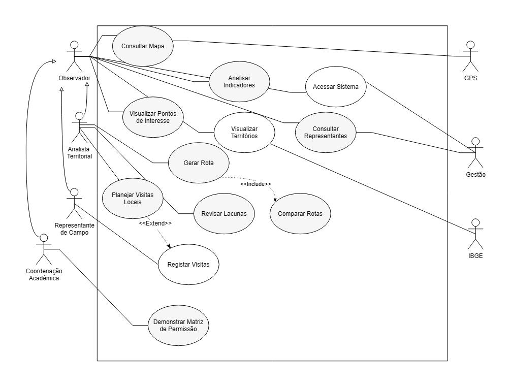

# Diagramas

> **Nota de Conformidade (Diagramas):**
> Em atendimento ao requisito de _"Armazene fontes editáveis e exportações sanitizadas dos diagramas"_, este README utiliza imagens geradas via Draw.io com a opção de **cópia do diagrama embutida**. Dessa forma, o arquivo de imagem na raiz cumpre simultaneamente duas funções: atua como a **exportação sanitizada** para a renderização limpa e visualização direta neste README, e armazena a **fonte editável** (podendo ser arrastada de volta para o editor do Draw.io a qualquer momento para futuras manutenções), mantendo a estrutura do projeto limpa e centralizada.

---

